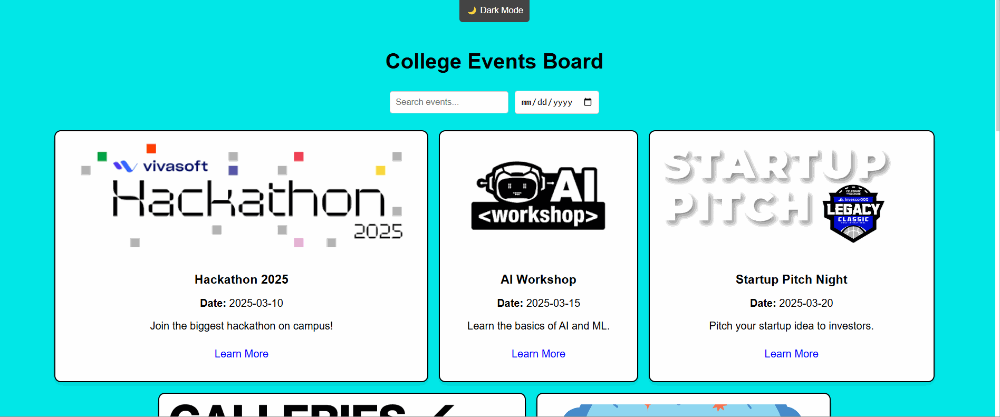

# Web Development Project 1 - College Events Board!

Submitted by: Rahat Moktadir

This web app: A simple React-based web app showcasing a collection of college events. This project allows users to browse events in a card format, view event details, and access links for more information. It features a responsive design, light blue background, and interactive card hover effects.

Time spent: 3 hours spent in total

## Required Features

The following **required** functionality is completed:

- [x] **There is a unique theme for events or resources relevant to a specific community**
- [x] **At least 10 unique resources or events are displayed in a responsive card format**

The following **optional** features are implemented:

- [x] Buttons or links to a related resources are on each card component
- [x] The site is responsive for both desktop and mobile formats

The following **additional** features are implemented:

- [x] Light/Dark mode toggle
- [x] Search bar for filtering events
- [x] Event sorting by date or category
- [x] Interactive hover effects on cards.

## Video Walkthrough

Here's a walkthrough of implemented required features:

GIF created with [LiceCap](https://www.cockos.com/licecap/).

## Notes

One challenge I faced was handling dynamic data:
Managing the data for events (titles, dates, descriptions, links) and passing them as props was straightforward, but ensuring each event had its own unique properties and images required organizing the data efficiently.

## License

    Copyright [yyyy] [name of copyright owner]

    Licensed under the Apache License, Version 2.0 (the "License");
    you may not use this file except in compliance with the License.
    You may obtain a copy of the License at

        http://www.apache.org/licenses/LICENSE-2.0

    Unless required by applicable law or agreed to in writing, software
    distributed under the License is distributed on an "AS IS" BASIS,
    WITHOUT WARRANTIES OR CONDITIONS OF ANY KIND, either express or implied.
    See the License for the specific language governing permissions and
    limitations under the License.
